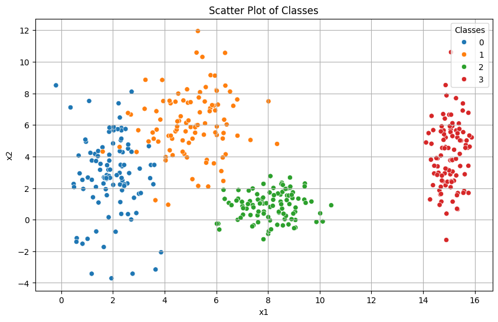
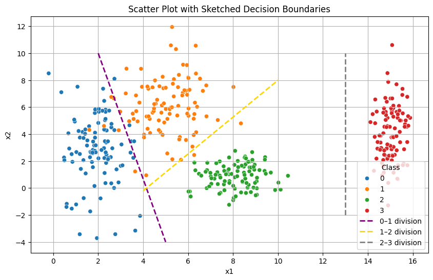
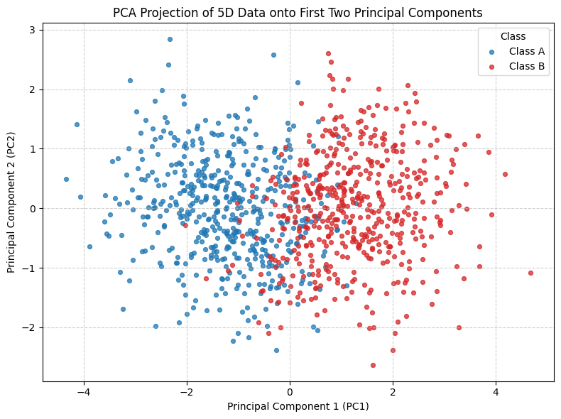
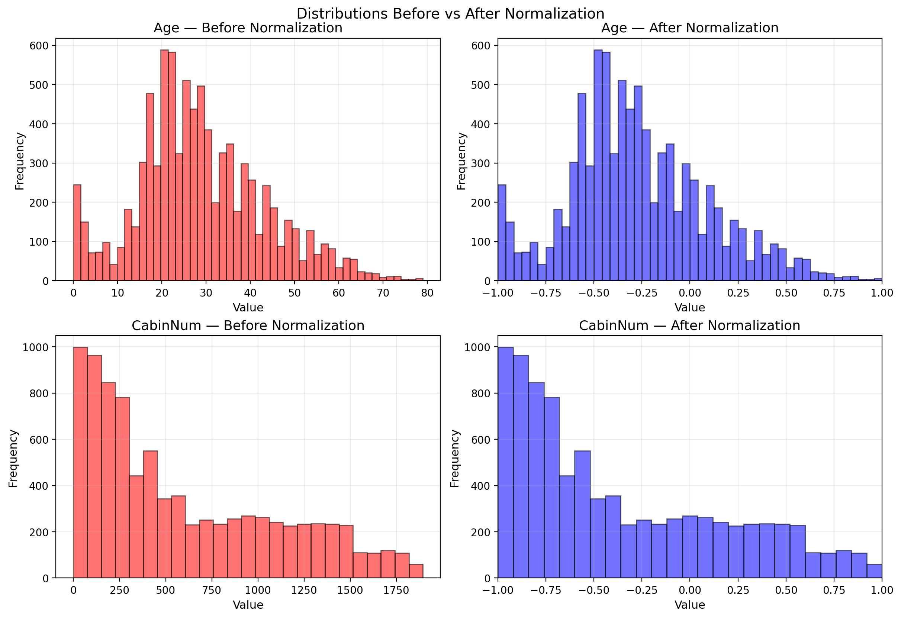

# 1. Data

## Exercise 1 – Exploring Class Separability in 2D

### **1) Data Generation**

Create a synthetic 2D dataset with **400 samples**, evenly split across **four classes** (100 each).  
Each class is sampled independently from a **Gaussian (normal) distribution** with its own mean and per-axis standard deviations:

- **Class 0:** mean ≈ **(2, 3)**, std ≈ **(0.8, 2.5)**
- **Class 1:** mean ≈ **(5, 6)**, std ≈ **(1.2, 1.9)**
- **Class 2:** mean ≈ **(8, 1)**, std ≈ **(0.9, 0.9)**
- **Class 3:** mean ≈ **(15, 4)**, std ≈ **(0.5, 2.0)**

**What this means.** For each class \(c\), we draw 100 points \((x_1, x_2)\) where:
- \(x_1 \sim \mathcal{N}(\mu_{c,1}, \sigma_{c,1})\)
- \(x_2 \sim \mathcal{N}(\mu_{c,2}, \sigma_{c,2})\)

This produces four “clouds” of points centered around their means, with vertical/horizontal spread governed by the standard deviations.

??? example "Data Generation Code"
    ```python
    import numpy as np
    import pandas as pd

    # Class definitions
    params = {
        0: {"mean": [2, 3],   "std": [0.8, 2.5]},
        1: {"mean": [5, 6],   "std": [1.2, 1.9]},
        2: {"mean": [8, 1],   "std": [0.9, 0.9]},
        3: {"mean": [15, 4],  "std": [0.5, 2.0]},
    }

    N = 100
    rng = np.random.default_rng()

    # Create individual DataFrames
    dfs = []
    for cls, p in params.items():
        x1 = rng.normal(p["mean"][0], p["std"][0], N)
        x2 = rng.normal(p["mean"][1], p["std"][1], N)
        df_cls = pd.DataFrame({"class": cls, "x1": x1, "x2": x2})
        dfs.append(df_cls)

    # Concatenate all DataFrames
    df = pd.concat(dfs, ignore_index=True)
    print(df.head(10))
    ```
---

### **2) Plot the Data**



*Figure 1 — 2D scatter plot of the generated dataset. Each color represents a different class.*

---

### **3) Analyze and Draw Boundaries**

#### a. Scatter Plot Analysis

By examining the scatter plot, it is possible to identify the following patterns:

- **Class 0 (blue)** forms a cluster on the left side, centered around (2,3). It shows a high vertical spread, which causes partial overlap with the lower points of Class 1.  
- **Class 1 (orange)** is located slightly to the right and above Class 0, centered near (5,6). Due to its vertical dispersion, it overlaps not only with the upper boundary of Class 0 but also approaches the top region of Class 2.  
- **Class 2 (green)** is concentrated near (8,1), with a smaller variance, making it more compact. However, it still lies close to the bottom of Class 1, leading to a noticeable boundary interaction.  
- **Class 3 (red)** is clearly separated on the far right, around (15,4). This class does not show any significant overlap with the others, making it the easiest to isolate.  

In summary, Classes 0, 1, and 2 show **areas of overlap** due to their vertical spread and proximity along the x-axis, while Class 3 remains **well isolated** from the others.

#### **b. Linear Separability**

A single linear boundary cannot separate all four classes. As illustrated by the sketched straight lines (purple for Class 0–1, yellow for Class 1–2, and a gray vertical line isolating Class 3), we already need **multiple** linear cuts to approximate the partitions. Even then, misclassifications remain:

- **Class 3** can be isolated with a vertical line on the far right.
- **Classes 0 and 1** overlap vertically; any straight line will mislabel points near the central band.
- **Classes 1 and 2** intersect around the lower edge of Class 1 and the upper edge of Class 2; a diagonal line reduces but does not eliminate errors.

Therefore, while straight lines help illustrate partial separation, **linear decision boundaries alone cannot perfectly separate all classes** due to the overlap and shaped spreads of Classes 0, 1, and 2.

#### **c. Decision boundaries (sketch)**

Below I include the **sketch** of decision boundaries that a trained neural network might learn.  
In this illustration I use **three straight lines**: a **diagonal** separating **Classes 0–1**, another **diagonal** separating **Classes 1–2**, and a **vertical** line isolating **Class 3** on the far right.



*Figure 2 — Three straight separators: 0–1 (diagonal), 1–2 (diagonal), and 2–3 (vertical).*

??? example "Code used to draw the sketch (replace coordinates with your final ones)"
    ```python
    plt.figure(figsize=(10, 6))

    # Scatter plot of the classes
    sns.scatterplot(data=df, x="x1", y="x2", hue="classe", palette="tab10")

    # Manually sketched straight lines (approximate coordinates)
    line1_x = [2, 5]
    line1_y = [10, -4]

    line2_x = [4, 10]
    line2_y = [-0.2, 8]

    line3_x = [13, 13]
    line3_y = [-2, 10]

    # Plot the lines
    plt.plot(line1_x, line1_y, color="purple", linewidth=2, linestyle="--", label="0–1 division")
    plt.plot(line2_x, line2_y, color="gold", linewidth=2, linestyle="--", label="1–2 division")
    plt.plot(line3_x, line3_y, color="gray", linewidth=2, linestyle="--", label="2–3 division")

    # Styling
    plt.title("Scatter Plot with Sketched Decision Boundaries")
    plt.xlabel("x1")
    plt.ylabel("x2")
    plt.legend(title="Class", loc="lower right")
    plt.grid(True)
    plt.show()
    ```

## Exercise 2 — Non-Linearity in Higher Dimensions

### **1) Data Generation**

**Goal.** Create a 5-dimensional dataset with two classes (**A** and **B**), each containing **500 samples**.  
The samples are drawn from **multivariate Gaussian distributions** with different means and covariance matrices:

- **Class A:** centered around the origin (0, 0, 0, 0, 0) with moderate positive correlations among features.  
- **Class B:** centered at (1.5, 1.5, 1.5, 1.5, 1.5) with slightly different correlations and variances.  

This setup produces two overlapping but distinguishable high-dimensional clusters, which makes linear separation difficult.

??? example "Data Generation Code"
    ```python
    import numpy as np
    import pandas as pd

    # Parameters for Class A
    mu_A = [0, 0, 0, 0, 0]
    Sigma_A = [
        [1.0, 0.8, 0.1, 0.0, 0.0],
        [0.8, 1.0, 0.3, 0.0, 0.0],
        [0.1, 0.3, 1.0, 0.5, 0.0],
        [0.0, 0.0, 0.5, 1.0, 0.2],
        [0.0, 0.0, 0.0, 0.2, 1.0],
    ]

    # Parameters for Class B
    mu_B = [1.5, 1.5, 1.5, 1.5, 1.5]
    Sigma_B = [
        [1.5, -0.7, 0.2, 0.0, 0.0],
        [-0.7, 1.5, 0.4, 0.0, 0.0],
        [0.2, 0.4, 1.6, 0.5, 0.0],
        [0.0, 0.0, 0.5, 1.5, 0.3],
        [0.0, 0.0, 0.0, 0.3, 1.5],
    ]

    # Generate 500 samples for each class
    XA = rng.multivariate_normal(mu_A, Sigma_A, size=500)
    XB = rng.multivariate_normal(mu_B, Sigma_B, size=500)

    # Merge into a single dataset
    X = np.vstack([XA, XB])
    y = np.array([0]*500 + [1]*500)  # 0 = Class A, 1 = Class B

    # Create a DataFrame (Excel-style table)
    cols = [f"f{i}" for i in range(1, 6)]
    df = pd.DataFrame(X, columns=cols)
    df["class"] = y

    print(df.head())
    ```

### **2) Data Visualization (Dimensionality Reduction with PCA)**

Since the dataset lives in a **5-dimensional space**, direct visualization is not possible.  
To explore the separability of the two classes, we apply **Principal Component Analysis (PCA)** to project the standardized data into **two principal components (PC1 and PC2)**.

??? example "Code for Dimensionality Reduction and Visualization"
    ```python
    import numpy as np
    import matplotlib.pyplot as plt
    from sklearn.preprocessing import StandardScaler
    from sklearn.decomposition import PCA

    # Step 1 — Standardize features (mean = 0, std = 1 per column)
    scaler = StandardScaler()
    X_std = scaler.fit_transform(X)

    # Step 2 — PCA projection to 2 dimensions
    pca = PCA(n_components=2, random_state=42)
    Z = pca.fit_transform(X_std)

    print("Explained variance by PC1 and PC2:",
          np.round(pca.explained_variance_ratio_, 4))
    print("Total variance explained (PC1+PC2):",
          np.round(pca.explained_variance_ratio_.sum(), 4))

    # Step 3 — Scatter plot of projected data
    colors = {0: "#1f77b4", 1: "#d62728"}  # Blue = Class A, Red = Class B
    labels = {0: "Class A", 1: "Class B"}

    plt.figure(figsize=(8, 6))
    for c in (0, 1):
        mask = (y == c)
        plt.scatter(Z[mask, 0], Z[mask, 1],
                    s=18, alpha=0.75,
                    label=labels[c],
                    c=colors[c])
    plt.xlabel("Principal Component 1 (PC1)")
    plt.ylabel("Principal Component 2 (PC2)")
    plt.title("PCA Projection of 5D Data onto First Two Principal Components")
    plt.legend(title="Class")
    plt.grid(True, linestyle="--", alpha=0.6)
    plt.tight_layout()
    plt.show()
    ```



*Figure 3 — PCA projection of the 5D dataset into 2D. Each point corresponds to one sample, colored by class (blue = Class A, red = Class B).*

---

### **3) Analysis of the PCA Projection**

#### a. Relationship Between the Two Classes

The scatter plot shows the dataset after projection into the first two principal components (PC1 and PC2).  
Some clear patterns can be observed:

- **Class A (blue)** is concentrated on the left-hand side of the PC1 axis, although it spreads vertically along PC2.  
- **Class B (red)** is mostly located on the right-hand side, also with some vertical dispersion.  
- The two classes are not completely isolated — there is a **noticeable overlapping region** around the center (PC1 ≈ 0), where samples from both classes mix.  

This indicates that while PCA successfully separates the clusters to some extent, the data distributions remain partially entangled.

#### b. Linear Separability

From the 2D projection, it becomes clear that a **single linear boundary** (for example, a vertical cut around PC1 = 0) could reduce the overlap but would **not perfectly separate the two classes**. Many points from Class A extend into the positive PC1 region, and several Class B points extend into the negative PC1 side.  

Thus, the data is **not strictly linearly separable**. Any linear classifier (such as a perceptron or logistic regression with a single decision boundary) would inevitably misclassify points in the overlapping zone.

This type of structure illustrates why **simple linear models are insufficient**.  
To capture the curved and complex boundary that better separates the two distributions, we require:

- **Non-linear activation functions** (e.g., *tanh*, ReLU), which allow the network to learn more flexible boundaries.  
- **Multiple layers**, enabling the model to progressively transform the feature space into one where the classes become more separable.  

In other words, a **multi-layer neural network with non-linearities** is more appropriate for this problem, since it can learn decision regions that are not restricted to simple linear cuts.

## Exercise 3 — Preparing Real-World Data for a Neural Network

### **1) Describe the Data**

The dataset comes from the **Kaggle competition Spaceship Titanic**.  
Its main objective is to predict whether a passenger was **transported to another dimension** after the collision of the spaceship Titanic with a spacetime anomaly.  

- The target variable is **`Transported`**, a boolean column:
  - `True` → the passenger was transported.
  - `False` → the passenger was not transported.

The dataset contains **14 columns** (including the target). They can be grouped as follows:

- **Numerical features (continuous values):**
  - `Age` → passenger’s age.
  - `RoomService` → amount spent in the room service.
  - `FoodCourt` → amount spent in the food court.
  - `ShoppingMall` → amount spent in the shopping mall.
  - `Spa` → amount spent in the spa.
  - `VRDeck` → amount spent in the VR deck.

- **Categorical features:**
  - `PassengerId` → unique passenger identifier.
  - `HomePlanet` → the planet where the passenger came from.
  - `CryoSleep` → whether the passenger was in cryogenic sleep (True/False).
  - `Cabin` → cabin identifier (deck/number/side).
  - `Destination` → destination planet.
  - `VIP` → whether the passenger is a VIP customer (True/False).
  - `Name` → passenger’s name.

To better understand the dataset, we analyzed the presence of missing values in each column.  
The following table shows the number of missing entries per feature:

- **HomePlanet**: 201  
- **CryoSleep**: 217  
- **Cabin**: 199  
- **Destination**: 182  
- **Age**: 179  
- **VIP**: 203  
- **RoomService**: 181  
- **FoodCourt**: 183  
- **ShoppingMall**: 208  
- **Spa**: 183  
- **VRDeck**: 188  
- **Name**: 200  

Columns **PassengerId** and **Transported** contain no missing values.

This confirms that several categorical (e.g., `HomePlanet`, `CryoSleep`) and numerical features (e.g., `Age`, `RoomService`) require preprocessing strategies to handle missing values before feeding the dataset into a neural network.

??? example "Code to Count Missing Values"
    ```python
    import pandas as pd

    # Load dataset
    df = pd.read_csv("train.csv")

    # Count missing values per column
    print("Missing values per column:")
    print(df.isnull().sum())
    ```

---

### **2) Preprocess the Data**

- **Numerical features (`Age`, `RoomService`, `FoodCourt`, `ShoppingMall`, `Spa`, `VRDeck`)**  
  → **Median imputation**.  
  *Why:* the median is robust to outliers (e.g., a few passengers with very high spending). Filling with median avoids biasing the distribution upwards like the mean would.

??? example "Code — Median imputation for numerical features"
    ```python
    import numpy as np

    # Numerical features
    num_cols = ["Age", "RoomService", "FoodCourt", "ShoppingMall", "Spa", "VRDeck"]

    df_num = df.copy()
    for col in num_cols:
        median_val = df_num[col].median()
        df_num[col] = df_num[col].fillna(median_val)
        print(f"{col}: filled NaNs with median = {median_val}")
    ```

- **Categorical features (`HomePlanet`, `CryoSleep`, `Destination`, `VIP`)**  
  → **Most frequent (mode) imputation**.  
  *Why:* keeps the dataset consistent by filling with the most common category, while not creating artificial new classes.

??? example "Code — Mode imputation for categorical features"
    ```python
    cat_cols = ["HomePlanet", "CryoSleep", "Destination", "VIP"]

    df_cat = df_num.copy()
    for col in cat_cols:
        mode_val = df_cat[col].mode(dropna=True)[0]
        df_cat[col] = df_cat[col].fillna(mode_val)
        print(f"{col}: filled NaNs with mode = {repr(mode_val)}")
    ```

- **Cabin**  
  → **Split into 3 separate features**: `Deck`, `CabinNum`, and `Side`.  
  - `Deck`: letter at the start.  
  - `CabinNum`: numeric part (converted to integer).  
  - `Side`: last letter (e.g., P or S).  
  After splitting, apply **mode imputation** to each of the three.  
  *Why:* splitting provides interpretable components instead of treating “Cabin” as a single string.

??? example "Code — Split Cabin and impute"
    ```python
    df_cabin = df_cat.copy()

    # Split Cabin into 3 parts
    cabin_split = df_cabin["Cabin"].str.split("/", expand=True)
    df_cabin["Deck"] = cabin_split[0]
    df_cabin["CabinNum"] = pd.to_numeric(cabin_split[1], errors="coerce")
    df_cabin["Side"] = cabin_split[2]

    # Drop original Cabin
    df_cabin = df_cabin.drop(columns=["Cabin"])

    # Impute Deck and Side with mode, CabinNum with median
    for col in ["Deck", "Side"]:
        mode_val = df_cabin[col].mode(dropna=True)[0]
        df_cabin[col] = df_cabin[col].fillna(mode_val)
        print(f"{col}: filled NaNs with mode = {repr(mode_val)}")

    cabin_num_median = df_cabin["CabinNum"].median()
    df_cabin["CabinNum"] = df_cabin["CabinNum"].fillna(cabin_num_median)
    print(f"CabinNum: filled NaNs with median = {cabin_num_median}")
    ```
---

After handling missing values in the previous step, our categorical features include:

- `HomePlanet`  
- `CryoSleep`  
- `Destination`  
- `VIP`  
- `Deck`  
- `Side`

*(Note: `Cabin` was already split into `Deck`, `CabinNum`, `Side`.)*

We will use **`pandas.get_dummies()`** for simplicity. It automatically creates new columns for each category.

??? example "Code — One-hot encoding with pandas"
    ```python
    # Assume df_clean is the dataset after missing value handling
    categorical_cols = ["HomePlanet", "CryoSleep", "Destination", "VIP", "Deck", "Side"]

    # One-hot encode categorical columns
    df_encoded = pd.get_dummies(df_clean, columns=categorical_cols, drop_first=False)

    print("Shape after encoding:", df_encoded.shape)
    print("Sample columns:", df_encoded.columns[:15].tolist())
    ```

- We use `drop_first=False` to **keep all categories**, ensuring no information loss.  
- This results in new binary columns like `HomePlanet_Earth`, `HomePlanet_Europa`, `HomePlanet_Mars`, etc.

From the dataset (after missing-value handling and encoding), the main numerical columns are:

- **Demographic & cabin info:** `Age`, `CabinNum`  
- **Spending features:** `RoomService`, `FoodCourt`, `ShoppingMall`, `Spa`, `VRDeck`

??? example "Code — Normalize numerical features"
    ```python
    import numpy as np

    # Numeric columns
    numeric_cols = ["Age", "CabinNum", "RoomService", "FoodCourt",
                    "ShoppingMall", "Spa", "VRDeck"]

    # Copy DataFrame
    df_normalized = df_encoded.copy()

    # Apply Min-Max normalization to [-1, 1]
    for col in numeric_cols:
        col_min = df_normalized[col].min()
        col_max = df_normalized[col].max()

        df_normalized[col] = 2 * (df_normalized[col] - col_min) / (col_max - col_min) - 1

        print(f"{col}: min={df_normalized[col].min()}, max={df_normalized[col].max()}")
    ```
Normalizing inputs to the range **[-1, 1]** aligns them with the natural output of the `tanh` activation, which is zero-centered. This keeps data in the central, high-slope region of the function, avoiding saturation near -1 or +1 where gradients vanish. It also balances features on the same scale, preventing large-valued variables from dominating smaller ones. As a result, training becomes more stable and convergence is faster when using `tanh`.

### **3) Visualization — Histograms Before/After Scaling**

Below we compare the distributions **before** and **after** normalization for two numerical features: **`Age`** and **`CabinNum`**.  



??? example "Code — Histograms (before vs. after normalization)"
    ```python
    import matplotlib.pyplot as plt

    # Expect these DataFrames from your pipeline:
    # df_encoded  -> before normalization
    # df_normalized -> after normalization (numeric in [-1, 1])

    fig, axes = plt.subplots(2, 2, figsize=(12, 8), constrained_layout=True)

    # ---- Age ----
    axes[0, 0].hist(df_encoded["Age"], bins=30, color="red", alpha=0.6, edgecolor="black")
    axes[0, 0].set_title("Age — Before Normalization")
    axes[0, 0].set_xlabel("Value"); axes[0, 0].set_ylabel("Frequency"); axes[0, 0].grid(alpha=0.25)

    axes[0, 1].hist(df_normalized["Age"], bins=30, color="blue", alpha=0.6, edgecolor="black")
    axes[0, 1].set_title("Age — After Normalization")
    axes[0, 1].set_xlabel("Value"); axes[0, 1].set_ylabel("Frequency"); axes[0, 1].grid(alpha=0.25)
    axes[0, 1].set_xlim(-1, 1)

    # Match y-scale for Age row
    ymax_age = max(axes[0, 0].get_ylim()[1], axes[0, 1].get_ylim()[1])
    axes[0, 0].set_ylim(0, ymax_age); axes[0, 1].set_ylim(0, ymax_age)

    # ---- CabinNum ----
    axes[1, 0].hist(df_encoded["CabinNum"], bins=30, color="red", alpha=0.6, edgecolor="black")
    axes[1, 0].set_title("CabinNum — Before Normalization")
    axes[1, 0].set_xlabel("Value"); axes[1, 0].set_ylabel("Frequency"); axes[1, 0].grid(alpha=0.25)

    axes[1, 1].hist(df_normalized["CabinNum"], bins=30, color="blue", alpha=0.6, edgecolor="black")
    axes[1, 1].set_title("CabinNum — After Normalization")
    axes[1, 1].set_xlabel("Value"); axes[1, 1].set_ylabel("Frequency"); axes[1, 1].grid(alpha=0.25)
    axes[1, 1].set_xlim(-1, 1)

    # Match y-scale for CabinNum row
    ymax_cabin = max(axes[1, 0].get_ylim()[1], axes[1, 1].get_ylim()[1])
    axes[1, 0].set_ylim(0, ymax_cabin); axes[1, 1].set_ylim(0, ymax_cabin)

    fig.suptitle("Distributions Before vs After Normalization", fontsize=14, y=1.02)
    plt.savefig("histograms_age_cabinnum_before_after_simple.png", dpi=200, bbox_inches="tight")
    plt.show()

    ```