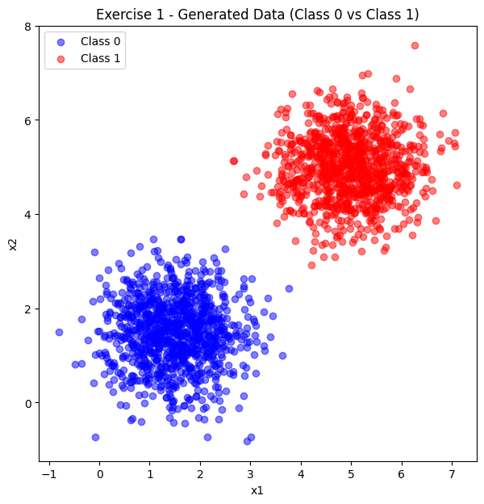
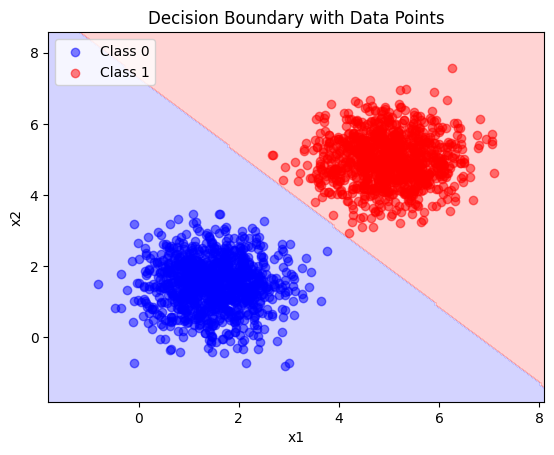
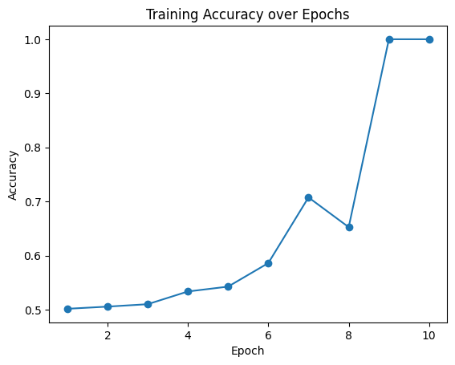
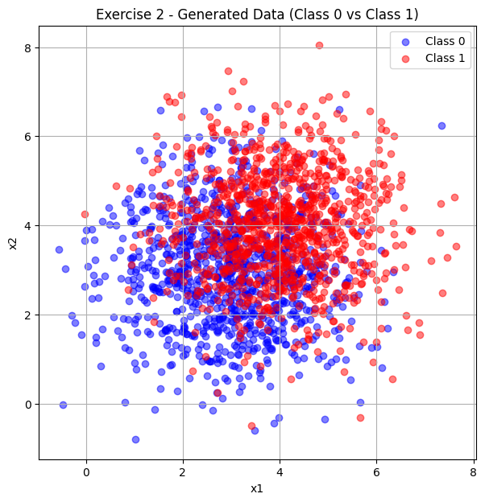
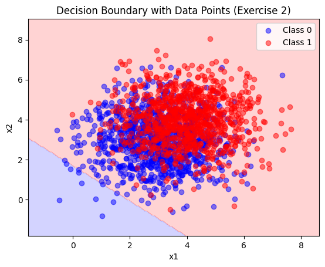
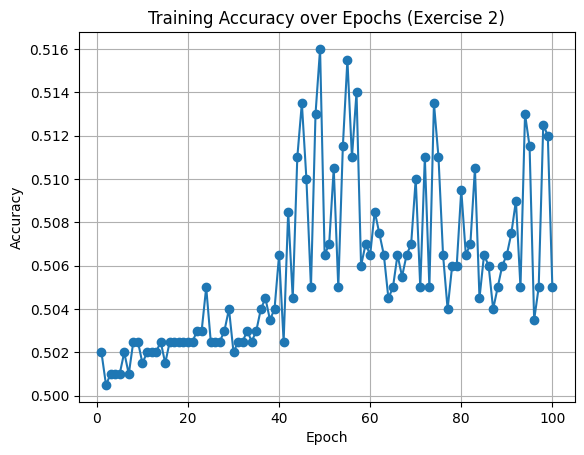

# 2. Perceptron

## Exercise 1

### **1) Data Generation**

We generate two classes of 2D data points (**1000 samples per class**) using multivariate normal distributions.  
The parameters are:

- **Class 0:**  
  Mean = [1.5, 1.5]  
  Covariance matrix = [[0.5, 0], [0, 0.5]]

- **Class 1:**  
  Mean = [5, 5]  
  Covariance matrix = [[0.5, 0], [0, 0.5]]

These settings ensure that the two classes are **mostly linearly separable**, since the means are far apart and the variance is small, causing minimal overlap.

??? example "Code — Data Generation"
    ```python
    import numpy as np

    # Parameters for Class 0
    mean_class0 = [1.5, 1.5]
    cov_class0 = [[0.5, 0], [0, 0.5]]

    # Parameters for Class 1
    mean_class1 = [5, 5]
    cov_class1 = [[0.5, 0], [0, 0.5]]

    # Number of samples per class
    n_samples = 1000

    # Generate data
    class0 = np.random.multivariate_normal(mean_class0, cov_class0, n_samples)
    class1 = np.random.multivariate_normal(mean_class1, cov_class1, n_samples)

    # Combine into dataset
    X = np.vstack((class0, class1))
    y = np.hstack((np.zeros(n_samples), np.ones(n_samples)))
    ```

---

### **2) Plot the Data**

We now plot the generated dataset to visualize the separation between the two classes.  
Each point is colored according to its class: **blue for Class 0** and **red for Class 1**.

??? example "Code — Scatter Plot"
    ```python
    import matplotlib.pyplot as plt

    plt.figure(figsize=(7, 7))
    plt.scatter(class0[:, 0], class0[:, 1], c="blue", alpha=0.5, label="Class 0")
    plt.scatter(class1[:, 0], class1[:, 1], c="red", alpha=0.5, label="Class 1")
    plt.legend()
    plt.title("Exercise 1 — Generated Data (Class 0 vs Class 1)")
    plt.xlabel("x1")
    plt.ylabel("x2")
    plt.grid(True)
    plt.show()
    ```



*Figure 1 — Scatter plot of the two generated classes. Class 0 (blue) is centered at (1.5, 1.5), while Class 1 (red) is centered at (5, 5). The two distributions are clearly separated, confirming linear separability.*

---

### **3) Perceptron Implementation**

#### a. Model Parameters

At its core, the perceptron keeps two types of parameters:

- **Weights (`w`)** → control the importance of each input feature.  
- **Bias (`b`)** → shifts the decision boundary away from the origin.  

Together, they form a **linear equation**:

\[
z = w_1 \cdot x_1 + w_2 \cdot x_2 + b
\]

If \(z \geq 0\), the perceptron predicts **Class 1**.  
If \(z < 0\), it predicts **Class 0**.

??? example "Code — Initialization"
    ```python
    class Perceptron:
        def __init__(self, input_dim, learning_rate=0.01, max_epochs=100):
            self.w = np.zeros(input_dim)   # weights
            self.b = 0.0                   # bias
            self.lr = learning_rate
            self.max_epochs = max_epochs
            self.accuracy_history = []
    ```

---

#### b. Activation Function

The perceptron uses a **step function** as its activation:  

- If the input is positive → output = 1.  
- Otherwise → output = 0.  

??? example "Code — Activation"
    ```python
        def activation(self, z):
            return 1 if z >= 0 else 0
    ```

---

#### c. Making Predictions

To classify a new point, the perceptron first computes the **weighted sum** of the inputs plus the bias:

\[
z = w_1 \cdot x_1 + w_2 \cdot x_2 + b
\]

Then, it applies the **step activation function**:

\[
\hat{y} =
\begin{cases}
1, & \text{if } z \geq 0 \\
0, & \text{if } z < 0
\end{cases}
\]

??? example "Code — Prediction"
    ```python
        def predict(self, X):
            z = np.dot(X, self.w) + self.b
            return np.where(z >= 0, 1, 0)
    ```

---

#### d. Learning Rule (Training)

The perceptron learns by **trial and error**:

1. Start with weights = 0 and bias = 0.  
2. For each training example:
      - Compute the prediction.  
      - Compare it to the true label.  
      - If wrong, **nudge the line** by updating weights and bias.  

Update rule:

\[
w_i \leftarrow w_i + \eta \cdot (y - \hat{y}) \cdot x_i \quad 
\]

\[
b \leftarrow b + \eta \cdot (y - \hat{y})
\]

Where:

- \(y\) = true label  
- \(\hat{y}\) = predicted label  
- \(\eta\) = learning rate  

Over time, the line moves so that it better separates the classes.

??? example "Code — Training"
    ```python
        def fit(self, X, y):
            for epoch in range(self.max_epochs):
                errors = 0
                for xi, target in zip(X, y):
                    prediction = self.activation(np.dot(xi, self.w) + self.b)
                    error = target - prediction
                    if error != 0:  # misclassified
                        self.w += self.lr * error * xi
                        self.b += self.lr * error
                        errors += 1

                # Track accuracy
                predictions = self.predict(X)
                accuracy = np.mean(predictions == y)
                self.accuracy_history.append(accuracy)

                if errors == 0:
                    print(f"Converged after {epoch+1} epochs.")
                    break
    ```

---

#### e. Evaluating the Model

Once trained, the perceptron can be evaluated by checking how many points it classifies correctly (accuracy).

??? example "Code — Score Function"
    ```python
        def score(self, X, y):
            predictions = self.predict(X)
            return np.mean(predictions == y)
    ```

---

#### f. Training on Our Data

We now train the perceptron on the dataset generated earlier.  
Since the data is linearly separable, we expect the perceptron to **converge quickly** and reach **100% accuracy**.

??? example "Code — Running the Model"
    ```python
    perceptron = Perceptron(input_dim=2, learning_rate=0.01, max_epochs=100)
    perceptron.fit(X, y)

    final_accuracy = perceptron.score(X, y)
    print("Final Weights:", perceptron.w)
    print("Final Bias:", perceptron.b)
    print("Final Accuracy:", final_accuracy)
    ```

### **4) Results and Conclusions**

After training the perceptron on the linearly separable dataset, we obtained the following results:

- **Converged after 10 epochs**  
- **Final Weights:** \([0.0236, \; 0.0219]\)  
- **Final Bias:** \(-0.16\)  
- **Final Accuracy:** 100%  
---

#### a. Decision Boundary

The decision boundary is defined by the linear equation:

\[
w_1 \cdot x_1 + w_2 \cdot x_2 + b = 0
\]

Substituting the final parameters:

\[
0.0236 \cdot x_1 + 0.0219 \cdot x_2 - 0.16 = 0
\]

This line divides the 2D space into two regions:

- Points classified as **Class 0 (blue)** when \(z < 0\).  
- Points classified as **Class 1 (red)** when \(z \geq 0\).  

??? example "Code — Plot Decision Boundary"
    ```python
    def plot_decision_boundary(X, y, model):
      x_min, x_max = X[:, 0].min() - 1, X[:, 0].max() + 1
      y_min, y_max = X[:, 1].min() - 1, X[:, 1].max() + 1
      xx, yy = np.meshgrid(np.linspace(x_min, x_max, 200),
                          np.linspace(y_min, y_max, 200))
      grid = np.c_[xx.ravel(), yy.ravel()]
      Z = model.predict(grid).reshape(xx.shape)

      # Use bwr colormap so 0=blue, 1=red
      plt.contourf(xx, yy, Z, alpha=0.2, cmap=plt.cm.bwr)

      plt.scatter(X[y==0][:, 0], X[y==0][:, 1], c="blue", label="Class 0", alpha=0.5)
      plt.scatter(X[y==1][:, 0], X[y==1][:, 1], c="red", label="Class 1", alpha=0.5)

      # Highlight misclassified points
      predictions = model.predict(X)
      misclassified = X[predictions != y]
      if len(misclassified) > 0:
          plt.scatter(misclassified[:, 0], misclassified[:, 1],
                      c="black", marker="x", label="Misclassified")

      plt.legend()
      plt.title("Decision Boundary with Data Points")
      plt.xlabel("x1")
      plt.ylabel("x2")
      plt.show()
    ```



*Figure 2 — Final decision boundary learned by the perceptron. The separation line clearly divides Class 0 (blue) and Class 1 (red).*

---

#### b. Accuracy over Epochs

During training, the perceptron progressively adjusted the weights and bias, improving classification accuracy at each epoch.  
Convergence was reached at **epoch 10**, after which no further updates were necessary.

??? example "Code — Accuracy Plot"
    ```python
    plt.plot(range(1, len(perceptron.accuracy_history)+1),
             perceptron.accuracy_history, marker="o")
    plt.title("Training Accuracy over Epochs")
    plt.xlabel("Epoch")
    plt.ylabel("Accuracy")
    plt.show()
    ```



*Figure 3 — Accuracy progression over epochs. The perceptron starts near random guessing (~50%) and quickly converges to 100% accuracy by epoch 10.*

---

#### c. Discussion

The results highlight the fundamental properties of the perceptron:

The perceptron converged after only 10 epochs, reaching 100% accuracy with final weights 
[
0.0236
,
0.0219
]
[0.0236,0.0219] and bias 
−
0.16
−0.16.
This quick convergence happens because the dataset is linearly separable: a straight line is sufficient to perfectly divide the two classes.
In such cases, the perceptron learning rule guarantees convergence in a finite number of steps, and the updates quickly adjust the decision boundary to separate the clusters without errors.

---

## Exercise 2 — Non-Linearly Separable Data

### **1) Data Generation**

We generate two classes of 2D data points (**1000 samples each**) using multivariate normal distributions.  

- **Class 0:**  
  Mean = [3, 3]  
  Covariance matrix = [[1.5, 0], [0, 1.5]]

- **Class 1:**  
  Mean = [4, 4]  
  Covariance matrix = [[1.5, 0], [0, 1.5]]


??? example "Code — Data Generation"
    ```python
    import numpy as np
    import matplotlib.pyplot as plt

    mean_class0 = [3, 3]
    cov_class0 = [[1.5, 0], [0, 1.5]]

    mean_class1 = [4, 4]
    cov_class1 = [[1.5, 0], [0, 1.5]]

    n_samples = 1000
    class0 = np.random.multivariate_normal(mean_class0, cov_class0, n_samples)
    class1 = np.random.multivariate_normal(mean_class1, cov_class1, n_samples)

    X2 = np.vstack((class0, class1))
    y2 = np.hstack((np.zeros(n_samples), np.ones(n_samples)))

    plt.figure(figsize=(7, 7))
    plt.scatter(class0[:, 0], class0[:, 1], c="blue", alpha=0.5, label="Class 0")
    plt.scatter(class1[:, 0], class1[:, 1], c="red", alpha=0.5, label="Class 1")
    plt.legend()
    plt.title("Exercise 2 - Generated Data (Class 0 vs Class 1)")
    plt.xlabel("x1")
    plt.ylabel("x2")
    plt.grid(True)
    plt.show()
    ```



*Figure 1 — Generated dataset. Strong overlap exists between Class 0 (blue) and Class 1 (red).*

---

### **2) Perceptron Training**

We reuse the same perceptron implementation from Exercise 1.  

??? example "Code — Training"
    ```python
    perceptron2 = Perceptron(input_dim=2, learning_rate=0.01, max_epochs=100)
    perceptron2.fit(X2, y2)

    final_accuracy2 = perceptron2.score(X2, y2)
    print("Final Weights:", perceptron2.w)
    print("Final Bias:", perceptron2.b)
    print("Final Accuracy:", final_accuracy2)
    ```

---

### **3) Results**

We visualize the decision boundary and training accuracy.

??? example "Code — Decision Boundary"
    ```python
    plot_decision_boundary(X2, y2, perceptron2)
    ```

  
*Figure 2 — Decision boundary found by the perceptron. Misclassified points are visible due to overlap.*

??? example "Code — Accuracy over Epochs"
    ```python
    plt.plot(range(1, len(perceptron2.accuracy_history)+1),
             perceptron2.accuracy_history, marker="o")
    plt.title("Training Accuracy over Epochs (Exercise 2)")
    plt.xlabel("Epoch")
    plt.ylabel("Accuracy")
    plt.grid(True)
    plt.show()
    ```

  
*Figure 3 — Accuracy progression over 100 epochs. The model oscillates around ~50%, never reaching full convergence.*

---

### **4) Conclusion**

The perceptron was trained on a dataset where the two classes present significant overlap. As a result, the algorithm was unable to find a linear decision boundary capable of perfectly separating the points. The decision boundary obtained (Figure 2) shows that many samples from both classes remain in the wrong region, confirming that misclassifications are unavoidable in this scenario. This behavior is also reflected in the training accuracy curve (Figure 3), which fluctuates around 50% and does not stabilize, indicating that the model could not effectively learn a separation rule. Since no epoch achieved a state without errors, the algorithm did not converge at any point during training, reaching the maximum of 100 epochs without success. These results reinforce one of the fundamental limitations of the perceptron: it only converges when the data is linearly separable. In problems where the distributions of the classes overlap, as in this exercise, the perceptron oscillates indefinitely and its accuracy remains close to random guessing. 